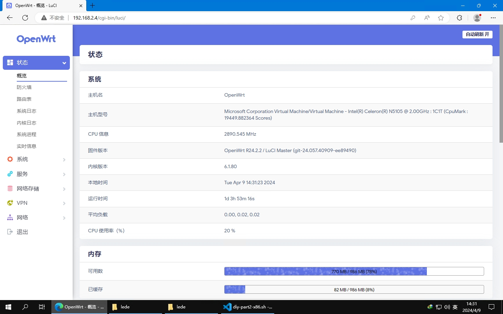

[简体中文](./README.zh-CN.md) | English

# About this repository

> This repository is based on [P3TERX/Actions-OpenWrt](https://github.com/P3TERX/Actions-OpenWrt) 
> [Lean](https://github.com/coolsnowwolf/lede)

Use Github Actions Automatically compile firmware for x86_64 devices
In principle, the firmware of this project is automatically compiled once a week, and you can also fork to modify it by yourself.  
If you think this project is good, you can star it, I will be very grateful!  

## Features

* ADGuard Home
* [OpenClash](https://github.com/vernesong/OpenClash)
* Wake-On-LAN
* DDNS
* More functions by themselves (may be refreshed from time to time to check)...

## Default IP address and password
   | project | value |
   | :--- | :--- |
   | Default IP address | `192.168.2.1` |
   | Default password | `none` |

## Screenshot

## Credits

* [Microsoft Azure](https://azure.microsoft.com/)
* [GitHub Actions](https://github.com/features/actions)
* [Lean](https://github.com/coolsnowwolf/lede)
* [tmate](https://github.com/tmate-io/tmate)
* [P3TERX](https://github.com/P3TERX)
* and all OpenWRT/Lede related contributors
