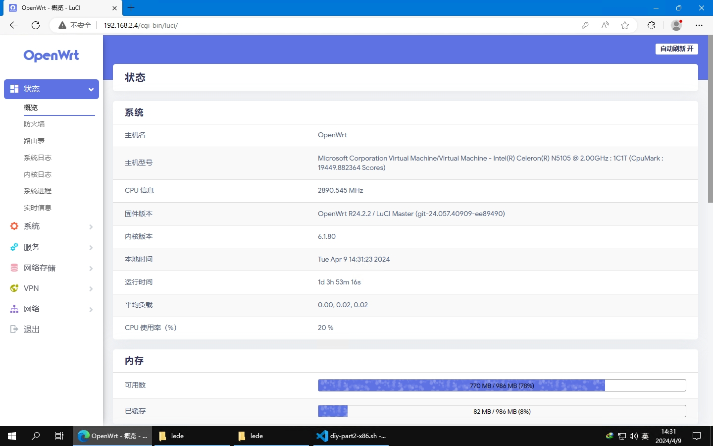

# 关于这个仓库

> 这个仓库基于[P3TERX/Actions-OpenWrt](https://github.com/P3TERX/Actions-OpenWrt) 
> [Lean](https://github.com/coolsnowwolf/lede)

用Github Actions为x86_64设备自动编译固件  
本项目的固件原则上每周自动编译一次，您也可以fork自行修改~  
如果您觉得本项目不错的话，可以Star一下，我会感激不尽的！就酱~  

## 特性

* ADGuard Home
* [OpenClash](https://github.com/vernesong/OpenClash)
* 网络唤醒
* DDNS
* 更多功能自行刷入查看(可能会不定期变动)...

## 后台进入方式和密码

   | 项目 | 值 |
   | :--- | :--- |
   | 默认后台地址 | `192.168.2.4` |
   | 默认后台密码 | `password` |

## 其它教程（大多数教程均来自互联网，此处作备份用） 

* [让AdGuard Home和OpenClash共存(自己做的设置，测试适用于本固件)](tutorial/adguard-openclash.md)

## 截图

## 感谢

* [Microsoft Azure](https://azure.microsoft.com/)
* [GitHub Actions](https://github.com/features/actions)
* [Lean](https://github.com/coolsnowwolf/lede)
* [tmate](https://github.com/tmate-io/tmate)
* [P3TERX](https://github.com/P3TERX)
* 以及所有跟OpenWRT/Lede等相关的贡献者
